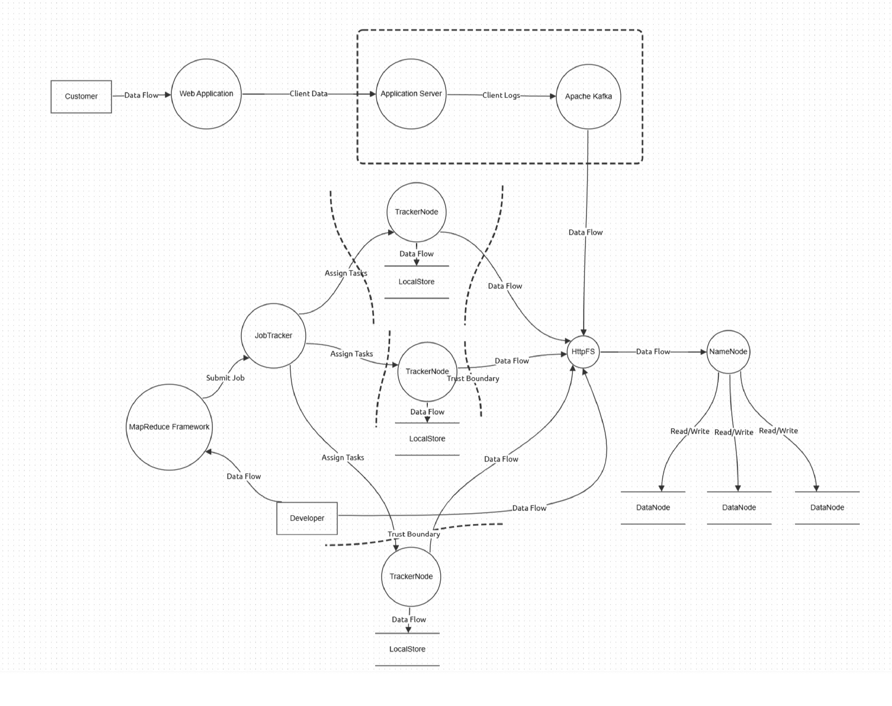
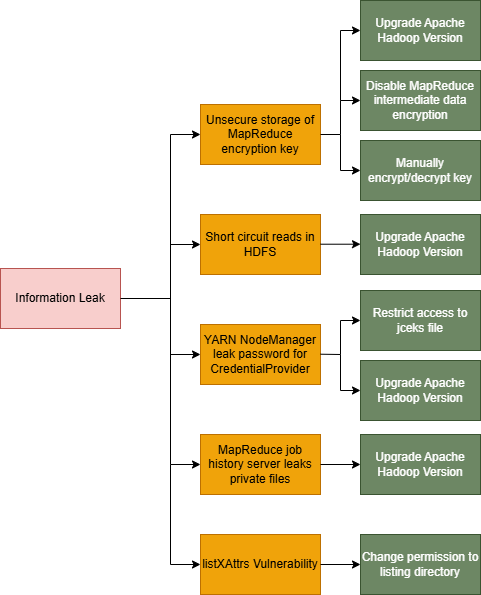
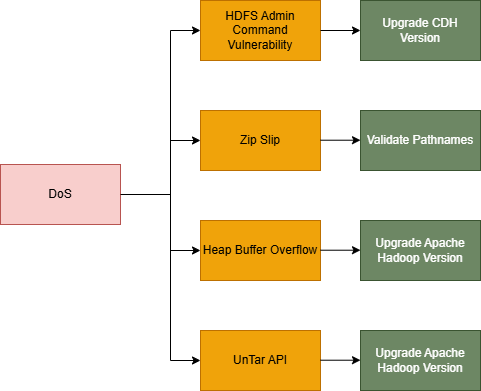
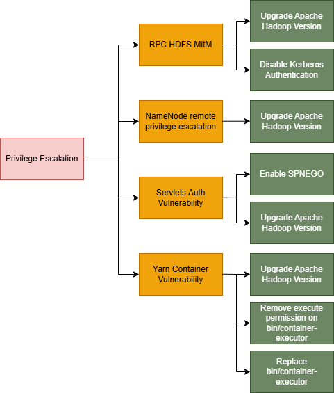

# Model pretnji za sistem zasnovan na Hadoop tehnologiji

Dokument definiše rezultate bezbednosne analize dizajna sistema zasnovanog na Hadoop tehnologiji. U primeru je korišćena zamišljena web aplikacija (slična Amazon internet prodavnici) koja koristi 
Hadoop tehnologiju za procesiranje velike količine podataka koja se generiše tokom korišćenja same aplikacije.

# Tokovi podataka analiziranog modula

Analiziran modul predstavlja aplikaciju za internet prodaju sa fokusom na Hadoop sistem za analizu prikupljenih podataka o korisnicima. Hadoop podsistem se sastoji iz sledećih komponenti:
- MapReduce Framework
- JobTracker
- TrackerNode klaster
- HttpFS
- NameNode
- DataNode klaster

Dijagram ispod prikazuje za analiziran modul.



# Resursi i pretnje visokog nivoa

U nastavku definišemo resurse sistema i pretnje visokog nivoa za svaki resurs.

| Resursi         | Pretnje                                         |
|-----------------|-------------------------------------------------|
| R1. Informacije o korisnicima | P11. Krađa informacija o korisnicima koji koriste web aplikaciju |
| R2. Apache Hadoop | P21. Denial of service Hadoop servisa |
|| P22. Eskalacija privilegija nad delovima Hadoop podsistema |

## R11. Krađa korisničkih podataka
Ispod se nalazi lista pretnji niskog nivoa, napada i bezbednosnih kontrola koje se izvlače iz analizirane pretnje:


## R21. Rušenje (DoS) Hadoop podsistema
Ispod se nalazi lista pretnji niskog nivoa, napada i bezbednosnih kontrola koje se izvlače iz analizirane pretnje:



## R22. Eskalacija privilegija nad delovima Hadoop podsistema
Ispod se nalazi lista pretnji niskog nivoa, napada i bezbednosnih kontrola koje se izvlače iz analizirane pretnje:



### A2133. Upload and execute scripts - analiza napada

Funkcionalost za upload datoteka smešta datoteke u nekakav direktorijum. Datoteke u okviru direktorijuma trebaju da budu dostupne putem veb čitača, kako bi pacijent mogao da proveri da li je okačio dobre fotografije i kako bi zubar video date dokumente.
Ako napadač može da okači malicioznu skriptu, koju zatim može da aktivira preko interneta, može da izvrši proizvoljan kod.

Scenarijo bi podrazumevao sledeće korake:
1. Napadač kači fotografiju, gde čak i sa proverom ekstenzije može da preruši `shell.php` u `shell.jpg`. Njegov zahtev ima sledeću strukturu:
   - Filename: shell.jpg
   - MIME type: image/jpeg
   - Content:
2. Server skladišti datoteku u dostupni `/fotografije/` direktorijum.
3. Napadač pristupa datoteci putem adrese `https://zubar.com/fotografije/shell.jpg?cmd=ls` i izvršava `ls` komandu, a zatim i sve ostalo što želi.

Da bi ovakav napad bio moguć, neophodno je sledeće:
- Da napadač uspeva da podmetne shell.php kao shell.jpg, što se otežava (ali ne uklanja) sa magic number proverom (M2133b).
- Da napadač ima pristup datoteci nakon što je postavljena na server.
- Da datoteka može da se izvrši (direktorijum ima `execute` pravo).

### Bezbednosne kontrole za pretnju P213. Image upload DoS
U nastavku je kod koji grupiše bezbednosne kontrole m2131, m2132, m2133a-c. Zbog integrisanosti koda su sve bezbednosne kontrole prikazane u celosti, a u opštem slučaju bismo vezali mitigacije za konkretan napad kada su one izolovane.

Komentari naglašavaju linije koda i funkcije koje predstavljaju konkretnu bezbednosnu kontrolu.

```csharp
[Route("api/[controller]")]
[ApiController]
public class FileUploadController : ControllerBase
{
    private const int MaxFileSizeInBytes = 1048576; // 1 MB
    private readonly string[] _allowedExtensions = { ".jpg", ".jpeg", ".png" };
    private readonly string _uploadFolder = Path.Combine(Directory.GetCurrentDirectory(), "Uploads");

    [HttpPost("upload")]
    public async Task<IActionResult> Upload([FromForm] IFormFile file)
    {
        try
        {
            var fileName = file.FileName;

            ValidateFileSize(file.Length);      // M2131
            ValidateFileExtension(fileName);    // M2133a

            byte[] fileBytes;
            using (var memoryStream = new MemoryStream())
            {
                await file.CopyToAsync(memoryStream);
                fileBytes = memoryStream.ToArray();
            }
            ValidateMagicNumber(fileBytes, fileName); // M2133b

            var secureFileName = GenerateSecureFileName(fileName); // M2132
            var filePath = Path.Combine(_uploadFolder, secureFileName); //m2133c (if execute is disabled)
            await SaveFileAsync(filePath, fileBytes);

            return Ok(new { Message = "File uploaded successfully!", FileName = secureFileName });
        }
        catch (Exception ex)
        {
            return StatusCode(500, new { Message = "File upload failed.", Error = ex.Message });
        }
    }

    private static void ValidateFileSize(long fileSize)
    {
        if (fileSize > MaxFileSizeInBytes)
        {
            throw new InvalidOperationException("File size exceeds the 1MB limit.");
        }
    }

    private void ValidateFileExtension(string fileName)
    {
        var fileExtension = Path.GetExtension(fileName)?.ToLower();
        if (fileExtension == null || !_allowedExtensions.Contains(fileExtension))
        {
            throw new InvalidOperationException("Invalid file type.");
        }
    }

    private static void ValidateMagicNumber(byte[] fileBytes, string fileName)
    {
        var fileExtension = Path.GetExtension(fileName)?.ToLower();

        if (fileExtension == ".jpg" || fileExtension == ".jpeg")
        {
            // JPEG magic numbers: FF D8 FF
            if (fileBytes.Length < 3 || fileBytes[0] != 0xFF || fileBytes[1] != 0xD8 || fileBytes[2] != 0xFF)
            {
                throw new InvalidOperationException("Invalid JPEG file.");
            }
        }
        else if (fileExtension == ".png")
        {
            // PNG magic numbers: 89 50 4E 47 0D 0A 1A 0A
            if (fileBytes.Length < 8 || fileBytes[0] != 0x89 || fileBytes[1] != 0x50 || fileBytes[2] != 0x4E ||
                fileBytes[3] != 0x47 || fileBytes[4] != 0x0D || fileBytes[5] != 0x0A || fileBytes[6] != 0x1A || fileBytes[7] != 0x0A)
            {
                throw new InvalidOperationException("Invalid PNG file.");
            }
        }
    }

    private static string GenerateSecureFileName(string originalFileName)
    {
        var fileExtension = Path.GetExtension(originalFileName)?.ToLower();
        return Guid.NewGuid() + fileExtension;
    }

    private static async Task SaveFileAsync(string filePath, byte[] fileBytes)
    {
        await System.IO.File.WriteAllBytesAsync(filePath, fileBytes);
    }
}
```